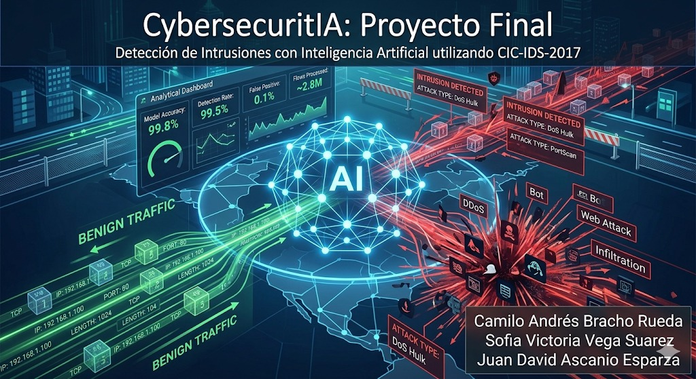

# CybersecurityIA: Proyecto Final de Inteligencia Artificial

## Sistema de Detección de Intrusiones en Redes mediante Machine Learning y Deep Learning

Este proyecto desarrolla e implementa modelos de Inteligencia Artificial para la detección de intrusiones en redes (Network Intrusion Detection System - NIDS), utilizando técnicas de Machine Learning y Deep Learning sobre el conjunto de datos de referencia **CIC-IDS-2017**.

El objetivo principal es identificar y clasificar flujos de red como tráfico legítimo (**BENIGN**) o tráfico malicioso asociado a diferentes tipos de ataques cibernéticos, contribuyendo al fortalecimiento de los sistemas de ciberseguridad mediante técnicas de análisis de datos e inteligencia artificial.

---

## 👥 Integrantes

* Camilo Andrés Bracho Rueda [@IIPythonxx](https://github.com/IIPythonxx)
* Sofia Victoria Vega Suarez [@codebysofiav](https://github.com/codebysofiav)
* Juan David Ascanio Esparza [@Juan-David-Ascanio](https://github.com/Juan-David-Ascanio)

---

## 📖 Descripción General

El crecimiento constante de los ciberataques ha generado la necesidad de desarrollar mecanismos de detección más robustos que complementen los sistemas tradicionales basados en firmas.

En este proyecto se implementa un enfoque basado en aprendizaje automático, donde diferentes modelos son entrenados para aprender patrones de comportamiento presentes en el tráfico de red y distinguir entre actividades legítimas y actividades maliciosas.

Se evaluaron técnicas de:

* Machine Learning supervisado.
* Deep Learning.
* Aprendizaje no supervisado.
* Reducción de dimensionalidad.

El sistema permite realizar:

* **Clasificación binaria:** determinar si un flujo corresponde a tráfico benigno o a un ataque.
* **Clasificación multiclase:** identificar el tipo específico de ataque presente en el tráfico.

---

## 📊 Dataset Utilizado

### CIC-IDS-2017 (Canadian Institute for Cybersecurity Intrusion Detection System 2017)

* **Cantidad de datos:** aproximadamente 2.8 millones de registros distribuidos en múltiples archivos CSV.
* **Fuente oficial:** https://www.unb.ca/cic/datasets/ids-2017.html
* **Versión utilizada:** https://www.kaggle.com/code/zulfianarahmi100/cic-ids-2017

### Descripción

El dataset contiene tráfico de red real capturado durante cinco días (3 al 7 de julio de 2017) en un entorno controlado por el Canadian Institute for Cybersecurity.

Los flujos de red fueron generados utilizando la herramienta **CICFlowMeter**, que calcula más de 80 características estadísticas por flujo, incluyendo:

* Duración de conexiones.
* Conteo de paquetes.
* Volumen de bytes transmitidos.
* Estadísticas de tamaño de paquetes.
* Indicadores TCP.
* Tasas de transferencia.
* Variables temporales de actividad del flujo.

### Tipos de Ataques Incluidos

* BENIGN (Tráfico legítimo)
* DoS Hulk
* DoS GoldenEye
* DoS slowloris
* DoS Slowhttptest
* DDoS
* PortScan
* FTP-Patator
* SSH-Patator
* Bot
* Web Attack – Brute Force
* Web Attack – XSS
* Web Attack – SQL Injection
* Infiltration
* Heartbleed

---

## ⚙️ Metodología

El desarrollo del proyecto siguió un flujo clásico de ciencia de datos:

### 1. Adquisición de Datos

* Descarga e integración de los archivos del dataset CIC-IDS-2017.
* Consolidación de la información para el análisis y modelado.

### 2. Preprocesamiento de Datos

* Eliminación de valores nulos.
* Tratamiento de valores infinitos.
* Limpieza de registros inconsistentes.
* Codificación de variables categóricas.
* Normalización y estandarización de características.

### 3. Ingeniería y Selección de Características

Se realizó una reducción de dimensionalidad sobre las más de 80 variables originales, conservando únicamente aquellas con mayor relevancia para la detección de intrusiones.

Además, se generaron nuevas variables mediante técnicas de feature engineering para capturar relaciones entre características del tráfico de red.

### 4. Modelos Supervisados

Se implementaron y compararon diferentes algoritmos de clasificación:

* Gaussian Naive Bayes (GNB)
* Decision Tree (DT)
* Random Forest (RF)
* Support Vector Machine (SVM)

### 5. Modelos de Deep Learning

Se desarrollaron múltiples arquitecturas de Redes Neuronales Densas (DNN), evaluando diferentes configuraciones de:

* Número de capas ocultas.
* Cantidad de neuronas.
* Funciones de activación.
* Técnicas de regularización.

### 6. Métodos No Supervisados

Se exploraron técnicas de agrupamiento para analizar patrones presentes en los datos sin utilizar etiquetas.

### 7. Reducción de Dimensionalidad

Se aplicaron técnicas como:

* PCA (Principal Component Analysis)
* t-SNE (t-Distributed Stochastic Neighbor Embedding)

con el fin de visualizar la estructura de los datos y evaluar la separabilidad entre clases.

---

## 📈 Métricas de Evaluación

Los modelos fueron evaluados mediante:

* Accuracy
* Precision
* Recall (TPR)
* Especificidad (TNR)
* F1-Score
* Matriz de Confusión

Debido a la naturaleza del problema, se dio especial importancia al **Recall (TPR)**, ya que minimizar falsos negativos es fundamental en sistemas de detección de intrusiones.

---

## 🔗 Recursos del Proyecto

### 🎥 Video de Presentación

https://www.youtube.com/watch?v=KpxOBqYJfSk

### 💻 Repositorio del Proyecto

https://github.com/codebysofiav/CybersecurityIA_Proyecto_Final

### 📊 Dataset

https://www.kaggle.com/code/zulfianarahmi100/cic-ids-2017

---

## 🎓 Información Académica

**Asignatura:** Inteligencia Artificial

**Universidad:** Universidad Industrial de Santander (UIS)

**Semestre:** 2025
